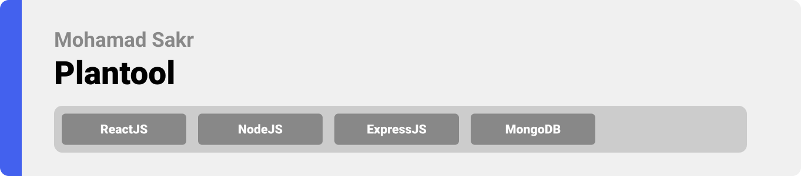
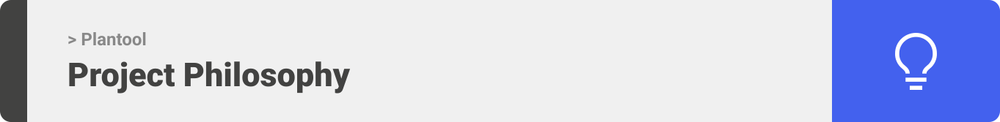
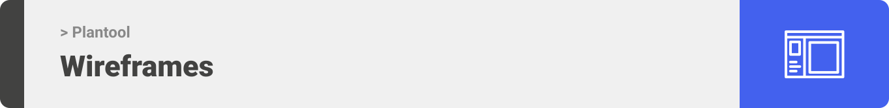
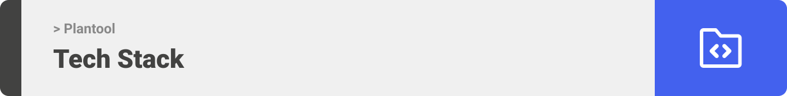
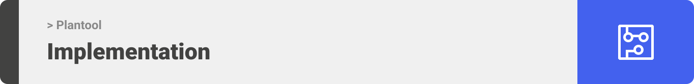
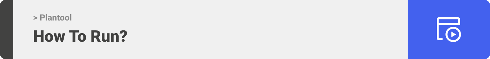

<div align="center">

> Hello world! Plantool is an internal website for companies that wants to assign projects to their employees and track billable hours.

**[PROJECT PHILOSOPHY](https://github.com/julescript/well_app#-project-philosophy) • [WIREFRAMES](https://github.com/julescript/well_app#-wireframes) • [TECH STACK](https://github.com/julescript/well_app#-tech-stack) • [IMPLEMENTATION](https://github.com/julescript/well_app#-impplementation) • [HOW TO RUN?](https://github.com/julescript/well_app#-how-to-run)**

</div>

<br><br>




> Plantool has 2 types of user access, admin and employee, but it is mainly focused on the admin type. Admins have full access to all the menus, where they can view planning chart, employees table, projects table, and statistics related to employees and projects. Also they can edit, create and update everything related to these tools. Plantool is all you need for your company.
 

### User Stories
- As an employee, I want a chart, so that I can see my schedule
- As an employee, I want a profile page, so that I can update my information
- As an admin, I want to edit a chart, so that I can assign projects to employees
- As an admin, I want a table, so that I can find quick information about an employee
- As an admin, I want a table, so that I can find quick information about a project
- As an admin, I want a menu, so that I can check billability


<br><br>



> This design was planned before on paper, then moved to Figma app for the fine details.
Note that i didn't use any styling library or theme, all from scratch and using pure css modules

| Landing  | Home/Planning  |
| -----------------| -----|
|  |  |

| Team Members  | Stats  |
| -----------------| -----|
|  |  |


<br><br>



Here's a brief high-level overview of the tech stack the Well app uses:

- This project uses the [React development library](https://reactjs.org/). React makes it painless to create interactive UIs. Design simple views for each state in your application, and React will efficiently update and render just the right components when your data changes.
- For persistent storage (database), the app uses [MongoDB](https://www.mongodb.com/) program which allows the app to create a custom storage schema and save it to a local database. MongoDB is a source-available cross-platform document-oriented database program. Classified as a NoSQL database program, MongoDB uses JSON-like documents with optional schemas.
- To send local push notifications, the app uses the [Firebase Cloud Messaging](https://firebase.google.com/docs/cloud-messaging) Firebase Cloud Messaging (FCM) is a cross-platform messaging solution that lets you reliably send messages at no cost.
- The app uses NodeJS to handle the back-end side of the project [Node.js](https://nodejs.org/en/) As an asynchronous event-driven JavaScript runtime, Node.js is designed to build scalable network applications. In the following "hello world" example, many connections can be handled concurrently. Upon each connection, the callback is fired, but if there is no work to be done, Node.js will sleep.
- The app uses ExpressJS framework to complement nodeJS [Express.js](https://expressjs.com/) released as free and open-source software under the MIT License. It is designed for building web applications and APIs. It has been called the de facto standard server framework for Node.js.


<br><br>


> Using the above mentioned tech stacks and the wireframes build with figma from the user sotries we have, the implementation of the app is shown as below, these are screenshots from the real app

| Landing  | Home/Planning  |
| -----------------| -----|
|  |  |

| Team Members  | Stats  |
| -----------------| -----|
|  |  |

| Push Notifications Foreground| Push Notifications Background  |
| -----------------| -----|
|  |  |


<br><br>



> This is an example of how you may give instructions on setting up your project locally.
To get a local copy up and running follow these simple example steps.

### Prerequisites

This is an example of how to list things you need to use the software and how to install them.
* npm
  ```sh
  npm install npm@latest -g
  ```

### Installation

_Below is an example of how you can instruct your audience on installing and setting up your app. This template doesn't rely on any external dependencies or services._

<!-- 1. Get a free API Key at [https://example.com](https://example.com)
2. Clone the repo
   ```sh
   git clone https://github.com/your_username_/Project-Name.git
   ```
3. Install NPM packages
   ```sh
   npm install
   ```
4. Enter your API in `config.js`
   ```js
   const API_KEY = 'ENTER YOUR API';
   ``` -->
  
1. Clone the repo
   ```sh
   git clone https://github.com/MohamadSakr96/Plantool.git
   ```
2. Go to front end folder
   ```sh
   cd front-end
   ```
3. Install NPM packages
   ```sh
   npm install
   ```
4. Run the app
   ```sh
   npm start
   ```


